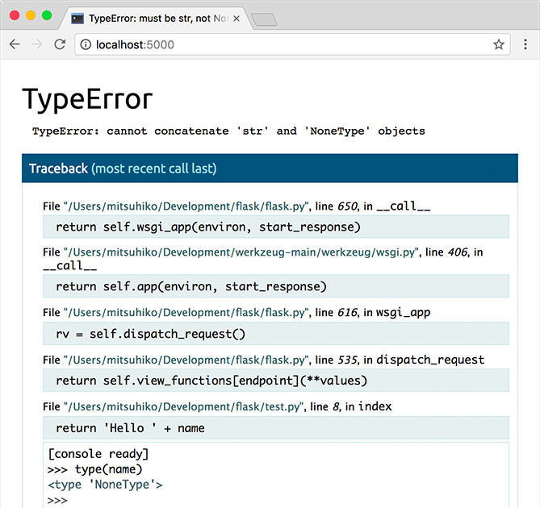

Быстрый старт
==================

Хочешь начать? Эта страница - хорошее начало для работы с Flask

Следуй инструкции - :doc:`install` , чтобы настроить проект и установить вначале Flask

Минимальное приложение
-----------------------

.. code-block:: python

  from flask import Flask

  app = Flask(__name__)

  @app.route("/")
  def hello_world():
      return "
Hello, World!
"

И так , что же делает этот код?

1. Вначале мы импортирует класс Flask. Экземляр этого класса будет WSGI приложение.

2. Далее, на основе класса, создаем экземляр (обьект ) класса.
Первый аргумент это название  модуля или пакета приложения.
__name__  это удобный ярлык, подходящий в большинстве случаев.
Это нужно для того, чтобы Flask знал, где искать такие ресурсы, как шаблоны и статические файлы.

3. Далее мы используем декоратор  route() чтобы объяснить Flask какой путь(Url)
должен запускать нашу функцию.

4. функция возвращает сообщение, которое мы хотим отобразиь в браузер.
По умолчению тип(content type) -HTML, ну и HTML в виде строки(string) будет
визуализироватся(render) в браузере

Сохраните код в файл hello.py или подобный. Не пытайтесь назвать файл flask.py N
так как это вызовет конфликт с самим Flask

Для вызова приложения, используйте команду python -m flask c опцией --app
чтобы назвать приложение которое вы запускаете.

.. code-block:: console

  $ flask --app hello run
   * Serving Flask app 'hello'
   * Running on http://127.0.0.1:5000 (Press CTRL+C to quit)

.. admonition:: Application Discovery Behavior

    As a shortcut, if the file is named ``app.py`` or ``wsgi.py``, you
    don't have to use ``--app``. See :doc:`/cli` for more details.

This launches a very simple builtin server, which is good enough for
testing but probably not what you want to use in production. For
deployment options see :doc:`deploying/index`.

Now head over to http://127.0.0.1:5000/, and you should see your hello
world greeting.

If another program is already using port 5000, you'll see
``OSError: [Errno 98]`` or ``OSError: [WinError 10013]`` when the
server tries to start. See :ref:`address-already-in-use` for how to
handle that.

.. _public-server:

.. admonition:: Externally Visible Server

   If you run the server you will notice that the server is only accessible
   from your own computer, not from any other in the network.  This is the
   default because in debugging mode a user of the application can execute
   arbitrary Python code on your computer.

   If you have the debugger disabled or trust the users on your network,
   you can make the server publicly available simply by adding
   ``--host=0.0.0.0`` to the command line::

       $ flask run --host=0.0.0.0

   This tells your operating system to listen on all public IPs.

Режим отладки(Debug Mode)
--------------------------

The ``flask run`` command can do more than just start the development
server. By enabling debug mode, the server will automatically reload if
code changes, and will show an interactive debugger in the browser if an
error occurs during a request.

.. warning::

    The debugger allows executing arbitrary Python code from the
    browser. It is protected by a pin, but still represents a major
    security risk. Do not run the development server or debugger in a
    production environment.

To enable debug mode, use the ``--debug`` option.

.. code-block:: text

    $ flask --app hello run --debug
     * Serving Flask app 'hello'
     * Debug mode: on
     * Running on http://127.0.0.1:5000 (Press CTRL+C to quit)
     * Restarting with stat
     * Debugger is active!
     * Debugger PIN: nnn-nnn-nnn

See also:

-   :doc:`/server` and :doc:`/cli` for information about running in debug mode.
-   :doc:`/debugging` for information about using the built-in debugger
    and other debuggers.
-   :doc:`/logging` and :doc:`/errorhandling` to log errors and display
    nice error pages.
